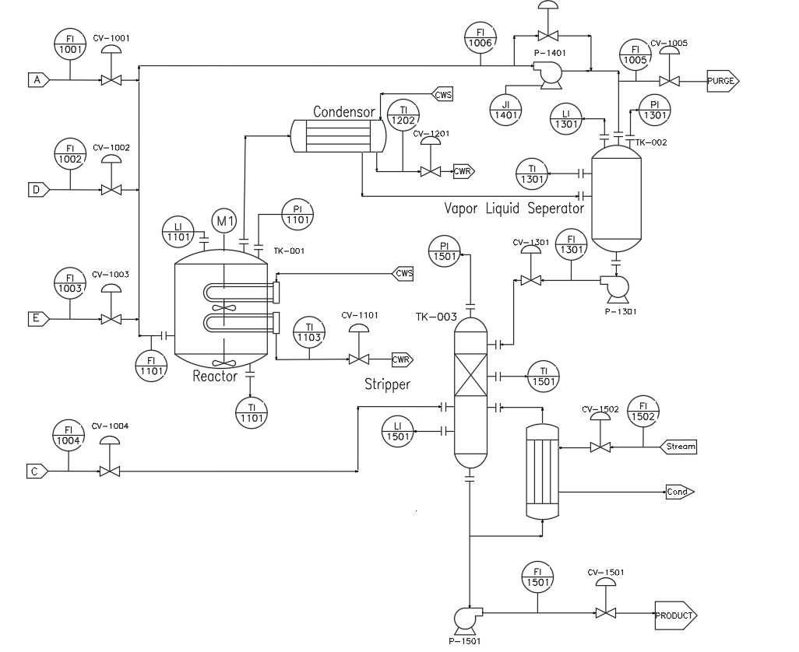

# process-sim

**Industrial process simulation and digital-twin research platform**  

`process-sim` uses the Tennessee Eastman Process (TEP) to explore process simulation, engineering information integration, operational history, and evidence-grounded retrieval.

**TEP NEXUS** is the repository's simulation-based semantic–temporal retrieval prototype. It connects AAS-derived engineering information in GraphDB with simulation-run-specific observations in TimescaleDB through explicit engineering-to-signal mappings and an on-demand Virtual Temporal Knowledge Graph (VTKG).

**SELiRA** is the contract-driven reference architecture for industrial life-cycle information. Its experimental SC-01 realization integrates SAFSL-to-SHACL compilation, evidence-aware qualification, controlled local admission and dependency-based reference reassessment over TEP NEXUS engineering RDF. See the [SELiRA architecture and implementation guide](selira_artifact/README.md) and [SC-01 evaluation](archive/selira_integration/evaluation/README.md).

## Architecture

| Component | Purpose |
| --- | --- |
| TEP simulator and OPC UA | Process simulation and operational signals |
| GraphDB | Engineering RDF and cross-domain relationships |
| TimescaleDB | Run-specific measurements and recorded events |
| TEP NEXUS | Mapping resolution, constrained retrieval, VTKG construction, and evidence validation |
| SELiRA | Experimental SC-01 contract qualification and local life-cycle orchestration |
| Vue Web UI | Simulation controls and engineering / historian queries |

The prototype uses predefined read-only retrieval operations and application-controlled validation. Engineering-to-signal mappings and product associations are provisional; the system is not a production-certified digital twin.

## Quick start

**Windows PowerShell**, from the repository root:

```powershell
python -m pip install -r requirements.txt
cd frontend
npm install
cd ..
```

Start the optional TimescaleDB historian:

```powershell
docker compose -f docker-compose.timeseries.yml up -d
```

Start each service in a separate terminal:

```powershell
# OPC UA simulation server
$env:PYTHONPATH="$PWD\src"
python examples/run_opcua_server.py --endpoint "opc.tcp://0.0.0.0:4841/process-sim/" --seed 42 --real-time-factor 1.0
```

```powershell
# HTTP API
$env:PYTHONPATH="$PWD\src"
python -m process_sim.api.server
```

```powershell
# Web UI
cd frontend
npm run dev
```

Open the URL printed by Vite and start the simulation using the Web UI. **GraphDB and published engineering RDF are required for TEP NEXUS semantic retrieval**; follow the [semantic setup guide](semantic/README.md) to create repository `AAST` and publish the graphs. Historian persistence and temporal queries additionally require TimescaleDB.

## Engineering Models

The Tennessee Eastman reactor engineering diagrams are available in [`docs/engineering-models/`](docs/engineering-models/).

### Reactor P&ID

[Open the reactor P&ID diagram](docs/engineering-models/tep-reactor-pid.png)



### Reactor ECAD

[Open the reactor ECAD diagram](docs/engineering-models/tep-reactor-ecad.png)


## Experimental Benchmarks and Results

### SHACL-grounded engineering query planning (MODELSWARD 2027)

The engineering benchmark contains 46 scenarios with five lexical formulations each (230 queries), evaluated with Qwen2.5-Coder 7B, Llama 3.1 8B, and Mistral 7B (690 query-model evaluations).

- [Full benchmark results (JSONL)](benchmarks/modelsward2027/full_benchmark_results.jsonl)
- [Benchmark queries and expected behavior](benchmarks/modelsward2027/benchmark_queries_modelsward2027.json)
- [Reference SPARQL queries](benchmarks/modelsward2027/reference_queries_modelsward2027.json)
- [Reference query validation results](benchmarks/modelsward2027/reference_validation_results.json)
- [Benchmark runner](benchmarks/modelsward2027/run_modelsward_benchmark.py)
- [Benchmark notes and review status](benchmarks/modelsward2027/README.txt)

The recorded result comparisons are provisional positional RDF binding comparisons, not independently verified semantic correctness labels. The benchmark manifest remains a candidate pending final review.

### Semantic–temporal retrieval (TEP NEXUS)

- [Recorded 36-case benchmark results and latency](docs/artifact_evaluation/README.md#3-recorded-benchmark-results-and-latency-2026-11-02)
- [Three-arm comparative experiment: deterministic, hybrid and full LLM](docs/artifact_evaluation/README.md#6-three-arm-comparative-experiment)
- [Recorded comparative results (324 executions)](docs/artifact_evaluation/README.md#61-recorded-comparative-results-local-execution)
- [Artifact inventory and reproducibility boundary](docs/artifact_evaluation/README.md#8-artifact-inventory-and-reproducibility-boundary)

The semantic–temporal figures are historical local experiment results based on limited-scope validation checks. The documentation records the results; the referenced historical raw result files are not accessible at their documented paths on this branch.

## Documentation

- [Experimental Docker Compose development stack](docs/docker-stack.md)
- [Historian and TimescaleDB setup](docs/opcua/TIMESERIES.md)
- [Semantic lifting and GraphDB setup](semantic/README.md)
- [TEP NEXUS evaluation and reproducibility](docs/artifact_evaluation/README.md)
- [SELiRA research prototype](selira_artifact/README.md)
- [Detailed project notes](docs/project-history-and-research-notes.md)

## Research

TEP NEXUS builds on **ONTO:NEXUS**: [*From Asset Administration Shells to Knowledge Graphs: Rule-Based Semantic Lifting for Cross-Domain Reasoning in Cyber-Physical Systems*](https://doi.org/10.1145/3837062.3839557).

The experimental results describe a bounded simulation-based implementation; a fresh clone does not include the exact historical run evidence needed to reproduce every reported result.
